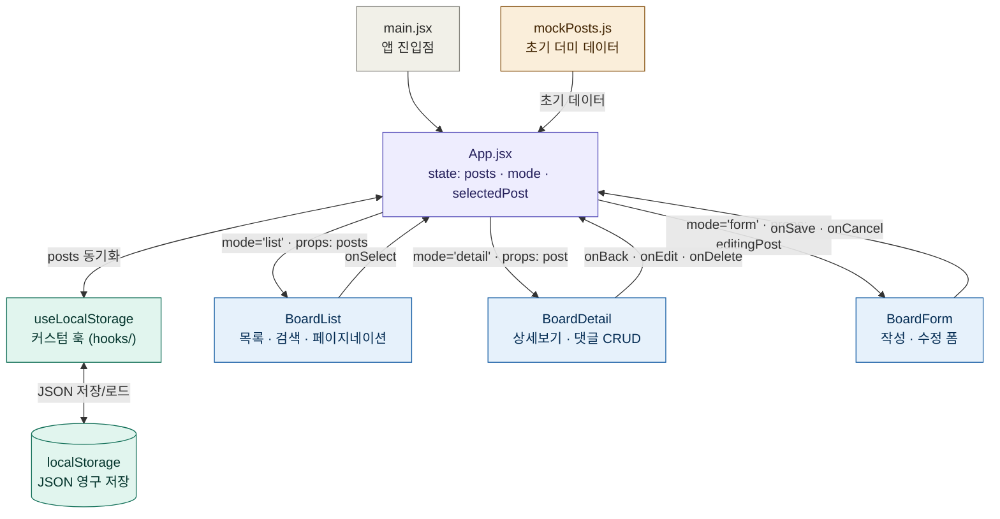

## 📊 데이터 흐름도



---

## 🗂️ 파일 역할 요약

| 파일 | 역할 |
|------|------|
| `main.jsx` | React 앱 진입점. `<App />`을 DOM에 마운트 |
| `App.jsx` | 화면 전환 컨트롤러. `mode` 상태로 `list / detail / form` 렌더링 결정 |
| `data/mockPosts.js` | `useLocalStorage` 초기값. localStorage가 비어있을 때만 사용 |
| `hooks/useLocalStorage.js` | 상태와 localStorage를 자동 동기화하는 커스텀 훅 |
| `components/BoardList.jsx` | 게시글 목록 출력, 제목 검색, 페이지네이션 |
| `components/BoardDetail.jsx` | 게시글 상세보기, 댓글 목록 및 작성, 삭제 확인 모달 |
| `components/BoardForm.jsx` | 게시글 작성(신규) / 수정(editingPost 전달 시) 폼 |

---

## 🔄 상태 흐름 요약

```
사용자 클릭
  └─ BoardList.onSelect(post)
       └─ App: setSelectedPost(post) + setMode('detail')
            └─ BoardDetail 렌더링

  └─ BoardDetail.onEdit()
       └─ App: setMode('form')  [selectedPost 유지]
            └─ BoardForm 렌더링 (수정 모드)

  └─ BoardForm.onSave(newPost)
       └─ App: handleSave → setPosts → setMode('list')
            └─ useLocalStorage → localStorage 자동 저장
```